# MY CALCULATOR PROJECT 
This is my first English readme.md, and it's a really big challenge for me.Maybe there are some grammatical problems, never mind. 

## The main ui about my calculator.
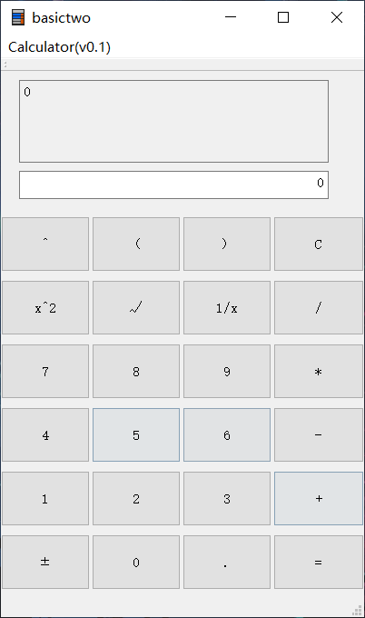
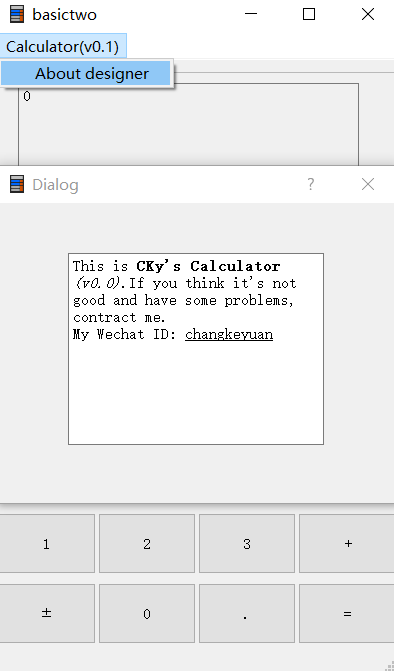
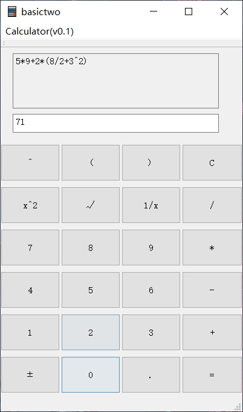

## About the *extra function* of my calculator and its implementation
1. Having a menuBar and QAction which can see "About Designer"  
Implementation:Create a new Dialog without Buttons and add a slot function to the QAction to show this new Dialog which contents something About Designer.  
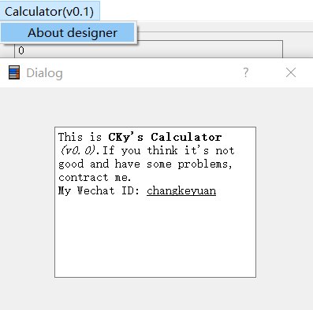
2. Adding a icon to my calculator  
Implementation:Add the icon file to the .exe catalog and open it in the .pro file.  

3. Having some more operator such as '^','(',')'.  
Implementation:Regard them as higher priority operators.  
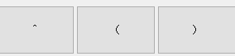  
4. using another textbrowser to show answer  
Implemextation:Just use the setText function. 
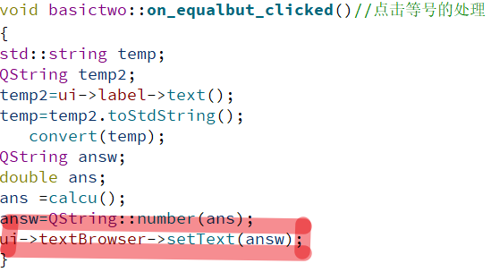

## Some technical details
1. Using the QSignalMapper.  
Implementation:First connect the button-clicked event with the map() in signalmapper,then use setmapping function.At last connect the map with slot function.
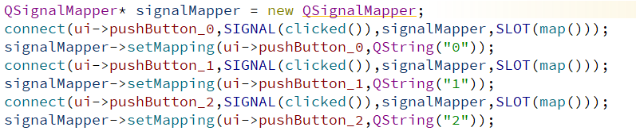
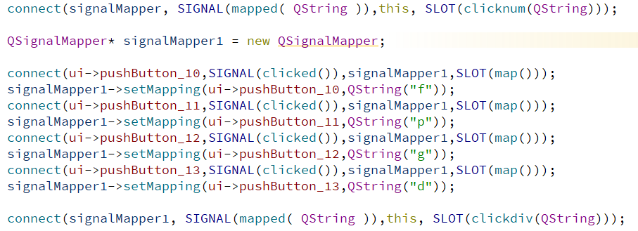
2. Handling of unary operators.  
Determine the position of the last digit from the end of the string.Then use mid() function to get the last digit, and use toDouble() function to turn a QString to double.At last deal with the number we get and use QString::number() funtion to turn a double to QString.  
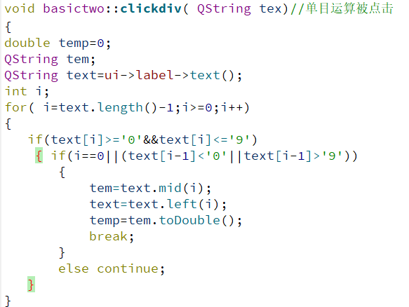
4. When number button and another button are clicked.
This is a slot function, just renew the QString and text.
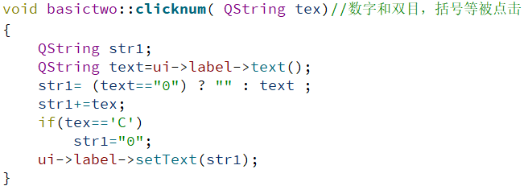
5. Converting infix expression to postfix expression.
The main idea is using the stack data structure. We use a new class named Opera to store a number or an operator. The stack is a Opera class stack. The postfix expression is a Opera class queue.We start scanning from the beginning of the infix expression.When it's a number, we push it into the queue.If it's an operator we should judge the priority and push it into the operator stack.The '('and ')'are the same, when we meet the ')',we should pop the operator until we get '('.Finally we push all operator into the postfix queue.
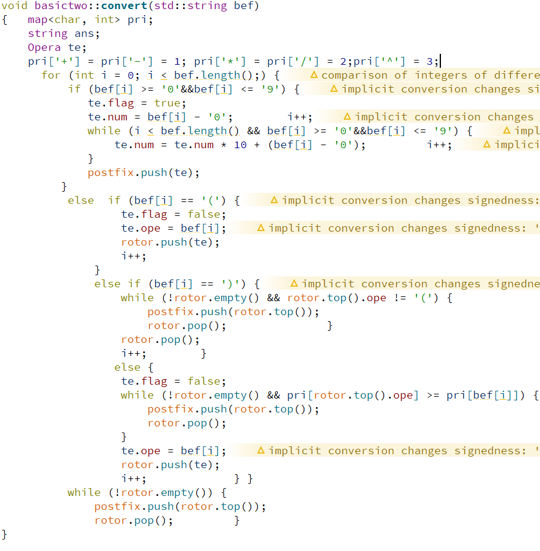
4. Dealing with the postfix expression.
The postfix expression is kept as a Opera class queue.We should scan from the beginning of this queue at first.If we get a number, we will push it into the number stack.And if we get a operator we should pop it up.The first operand is assigned to y,the last is assigned to x.Then we calculate and push the result into the number stack.We will get the last number in the stack, that is the answer.  
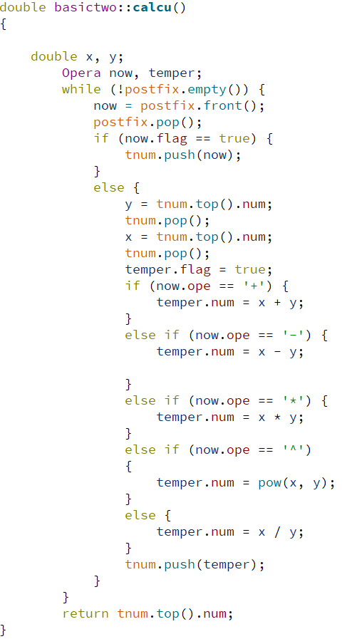

## About *.ui and ui_*.h
Firstly,ui_*.h is generated by uic(a Qt creator tool)after compiling the *.ui.  
When the content in the *.ui is modified by Designer, ui_*.h will also automatically update the content.The ui_*.h file is converted from *.ui to c++ file.  
It mainly does the following work:  
1. Defines a class Ui_* for encapsulating the visual design interface.  
2. Defines the member variables of each component of the interface.  
3. Defines a function named setupUi which is used to create individual interface components and sets their properties.  
4. Define the namespace Ui and define a class * that inherits from Ui_*.

## The problems I meet and solve.
1. Qaction click event link to a new dialog display.  
Solve:Adding a slot function in my basictwo.cpp and show the dialog.  
2. Can not use debug（Unable to create a debugging engine.）  
Solve:Dowload the windows kit and reload the debugger.  
3. The process was ended forcefully.  
Solve:Using a pointer without an assignment and assign it a value.
4. When I convert infix to postfix expression, I don't know how to indicate the priority of the operator.  
Solve:Using map in C++ STL which can store elements in a mapped fashion, and each element has a key value and a mapped value.So higher priority operator has a higher key value.
    

### Reference
* About *.ui and ui_*.h
  >[Qt入门学习——Qt Creator 中 ui 文件和 Qt 代码关系](https://blog.csdn.net/alpha_love/article/details/78250794)  
  >[Qt项目界面文件（.ui）及其作用](http://c.biancheng.net/view/1820.html)  
* About the implementation of the calculator algorithm  
  >[Map in C++ Standard Template Library (STL)](https://www.geeksforgeeks.org/map-associative-containers-the-c-standard-template-library-stl/)
  >[中缀表达式转换成后缀表达式与后缀表达式的计算过程](https://blog.csdn.net/a_silly_coder/article/details/80653015)

* About using QSignalMapper and some qt problems.
  >[QSignalMapper 信号映射](http://blog.sina.com.cn/s/blog_5e42f31a0100ykaz.html)  
  >[Qt学习笔记1－－更高级Signals and Slots的用法](http://blog.sina.com.cn/s/blog_5e42f31a0100ykaz.html)
  >[ The process was ended forcefully.](https://forum.qt.io/topic/88970/the-process-was-ended-forcefully/14)  
